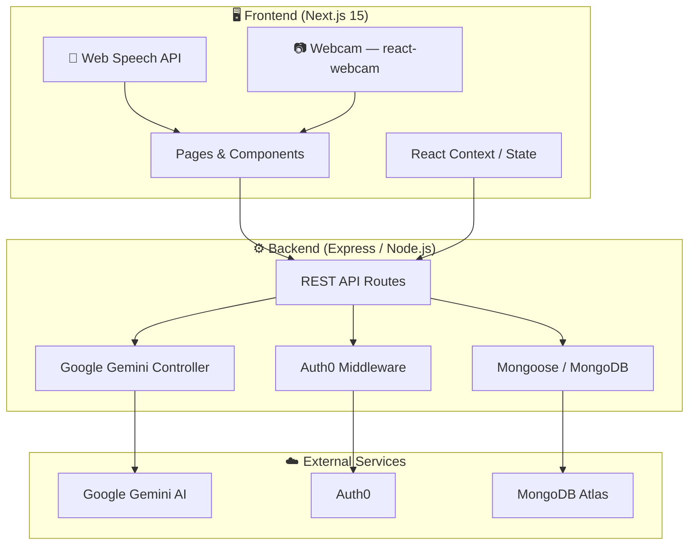

# 🚀 HirePro

<div align="center">

**A Full-Stack AI-Powered Job Platform — Find Work, Post Jobs, and Ace Interviews**

[](https://nextjs.org/)
[](https://nodejs.org/)
[](https://www.mongodb.com/)
[](https://ai.google.dev/)
[](https://auth0.com/)

*One platform for job seekers, recruiters, and candidates preparing for interviews.*

[Features](#-features) • [Architecture](#-architecture) • [Tech Stack](#-tech-stack) • [Installation](#-installation--setup) • [API Reference](#-api-reference)

</div>

---

## 📖 Overview

**HirePro** is a production-ready job platform that connects job seekers with employers, and helps candidates prepare with AI-powered mock interviews. It covers the full hiring lifecycle — from job discovery to application to interview preparation.

### 🎯 What it solves

Traditional job platforms are either too generic or too complex. HirePro is focused:

- **Job seekers** browse and apply to real roles with filters, search, and bookmarking
- **Employers** post roles, manage applicants, and reach qualified candidates
- **Candidates** practice mock interviews with AI-generated questions and instant feedback
- **Everyone** can read and write honest employer/role reviews

---

## ✨ Features

### 🔍 Job Discovery
- Full-text search by title, location, skills, and tags
- Filter by job type (Full Time, Part Time, Contract, Internship)
- Filter by salary range with live sliders
- Grid and list view toggle
- Bookmark jobs for later

### 📋 Job Management
- Post a role with rich-text description (WYSIWYG editor)
- Set salary, type, location, skills, and tags
- One-click recommended skills and tags for fast job creation
- View applicants per posting
- Edit and delete your own postings
- See liked and applied jobs in one place (My Jobs)

### 🤖 AI Mock Interview
- Generate interview questions for any job role and description using **Google Gemini AI**
- Voice-recorded answers via browser speech recognition
- AI evaluates each answer and provides a score + detailed feedback
- Full session feedback after completing all questions

### ⭐ Reviews
- Write reviews for companies and roles
- Star-rating system (1–5)
- Browse all community reviews

### 🔐 Authentication
- Auth0-powered login/register
- Session-based identity propagated across client and server
- Protected routes for posting, applications, and interview prep

---

## 🏗️ Architecture



### Service Map

| Layer | Technology | Port | Responsibility |
|-------|-----------|------|----------------|
| **Frontend** | Next.js 15 + Tailwind + shadcn/ui | 3001 | All user-facing pages and interactions |
| **Backend** | Node.js + Express | 7895 | REST API, Auth0 session, AI integration |
| **Database** | MongoDB Atlas + Mongoose | — | Jobs, users, interviews, answers, reviews |
| **AI** | Google Gemini API | — | Interview question generation + answer evaluation |
| **Auth** | Auth0 | — | Login, register, session management |

---

## 🛠️ Tech Stack

### Frontend
| Technology | Purpose |
|------------|---------|
| **Next.js 15** | React framework with App Router |
| **TypeScript** | Type-safe components and API calls |
| **Tailwind CSS** | Utility-first styling |
| **shadcn/ui** | Accessible UI component library |
| **Framer Motion** | Entrance and hover animations |
| **react-webcam** | Live camera feed during interviews |
| **Web Speech API** | Voice-to-text answer recording |
| **Axios** | HTTP client for API communication |
| **react-hot-toast** | Toast notifications |

### Backend
| Technology | Purpose |
|------------|---------|
| **Node.js + Express** | REST API server |
| **Mongoose** | MongoDB ODM |
| **Auth0** | Session-based authentication |
| **@google/generative-ai** | Gemini AI SDK for interview generation |
| **Nodemon** | Hot reload in development |

### Database & Storage
| Technology | Purpose |
|------------|---------|
| **MongoDB Atlas** | Primary database (jobs, users, interviews, reviews) |

---

## 📦 Installation & Setup

### Prerequisites

| Tool | Version | Notes |
|------|---------|-------|
| Node.js | 18+ | Both frontend and backend |
| npm | 9+ | Package management |
| MongoDB Atlas account | Free tier | [Sign up here](https://www.mongodb.com/cloud/atlas/register) |
| Auth0 account | Free tier | [Sign up here](https://auth0.com/signup) |
| Google AI API key | — | [Get one here](https://ai.google.dev/) |

### 1. Clone the repository

```bash
git clone https://github.com/aftermoon07/hirepro.git
cd hirepro
```

### 2. Server setup

```bash
cd server
npm install
```

Create `server/.env`:

```env
MONGO_URI=mongodb+srv://<user>:<password>@cluster.mongodb.net/hirepro
AUTH0_SECRET=your_auth0_secret
AUTH0_BASE_URL=http://localhost:7895
AUTH0_ISSUER_BASE_URL=https://your-tenant.auth0.com
AUTH0_CLIENT_ID=your_client_id
AUTH0_CLIENT_SECRET=your_client_secret
GEMINI_API_KEY=your_google_gemini_api_key
PORT=7895
```

Start the server:

```bash
npm start
# or for development with hot reload:
npm run dev
```

Server runs at **http://localhost:7895**

### 3. Client setup

```bash
cd ../client
npm install
```

Create `client/.env.local`:

```env
NEXT_PUBLIC_API_URL=http://localhost:7895/api
```

Start the client:

```bash
PORT=3001 npm run dev
```

Client runs at **http://localhost:3001**

### 4. Auth0 configuration

In your Auth0 dashboard:

1. Create a **Regular Web Application**
2. Set **Allowed Callback URLs**: `http://localhost:7895/callback`
3. Set **Allowed Logout URLs**: `http://localhost:7895`
4. Set **Allowed Web Origins**: `http://localhost:3001`
5. Copy the credentials into `server/.env`

---

## 📁 Project Structure

```
hirepro/
├── 📁 client/                        # Next.js Frontend
│   ├── app/
│   │   ├── page.tsx                  # Homepage
│   │   ├── findwork/                 # Job search & browse
│   │   ├── job/[id]/                 # Job detail page
│   │   ├── myjobs/                   # My posts, liked & applied jobs
│   │   ├── post/                     # Post a new job
│   │   ├── review/                   # Reviews list & create
│   │   │   ├── [id]/                 # Single review detail
│   │   │   └── create/               # Write a review
│   │   └── interview/                # AI interview module
│   │       ├── page.tsx              # Interview dashboard
│   │       ├── [id]/                 # Interview session
│   │       │   ├── start/            # Active interview (webcam + voice)
│   │       │   └── feedback/         # Post-interview feedback
│   │       └── _components/          # AddNewInterview dialog
│   ├── components/
│   │   ├── header.tsx                # Sticky nav header
│   │   ├── footer.tsx                # Footer
│   │   ├── SearchForm.tsx            # Search bar
│   │   ├── Filters.tsx               # Sidebar filters
│   │   ├── JobItem/
│   │   │   ├── jobCard.tsx           # Job listing card
│   │   │   └── MyJob.tsx             # My jobs card (with edit/delete)
│   │   └── PostJob/                  # Multi-section job form
│   ├── context/
│   │   ├── globalContext.js          # User auth + profile state
│   │   ├── jobsContext.js            # Jobs list, search, filters
│   │   ├── interviewContext.js       # Interview session state
│   │   └── reviewContext.js          # Reviews state
│   └── types/types.ts                # Shared TypeScript interfaces
│
└── 📁 server/                        # Express Backend
    ├── app.js                        # Entry point + Auth0 setup
    ├── controllers/
    │   ├── jobController.js          # CRUD for jobs + AI job helper
    │   ├── InterviewCon.js           # Interview creation + AI + feedback
    │   ├── userController.js         # User profile management
    │   └── reviewController.js       # Reviews CRUD
    ├── models/
    │   ├── jobModel.js               # Job schema
    │   ├── userModel.js              # User schema
    │   ├── interview_Model.js        # Mock interview schema
    │   ├── userAnswerSchema.js       # Answer + AI feedback schema
    │   └── reviewModel.js            # Review schema
    ├── routes/
    │   ├── jobroutes.js
    │   ├── interviewroutes.js
    │   ├── routesuser.js
    │   └── reviewroutes.js
    ├── middleware/
    │   └── protect.js                # Auth0 session guard
    └── db/
        └── db.js                     # MongoDB connection
```

---

## 🌐 API Reference

### Jobs — `/api/jobs`

| Method | Endpoint | Auth | Description |
|--------|----------|------|-------------|
| GET | `/api/jobs` | — | List all jobs (with optional search query) |
| POST | `/api/jobs` | ✅ | Create a new job posting |
| GET | `/api/jobs/:id` | — | Get a single job |
| PATCH | `/api/jobs/:id` | ✅ | Update a job |
| DELETE | `/api/jobs/:id` | ✅ | Delete a job |
| PUT | `/api/jobs/:id/like` | ✅ | Toggle bookmark |
| PUT | `/api/jobs/:id/apply` | ✅ | Apply to a job |

### Interviews — `/api/interview`

| Method | Endpoint | Auth | Description |
|--------|----------|------|-------------|
| POST | `/api/interview` | ✅ | Create interview + generate AI questions |
| GET | `/api/interview` | ✅ | Get user's interviews |
| GET | `/api/interview/:id` | ✅ | Get single interview + questions |
| POST | `/api/interview/answer` | ✅ | Save answer + get AI rating & feedback |
| GET | `/api/interview/feedback/:mockId` | ✅ | Get all answers + feedback for a session |

### Users — `/api/users`

| Method | Endpoint | Auth | Description |
|--------|----------|------|-------------|
| GET | `/api/users/profile` | ✅ | Get current user profile |
| PATCH | `/api/users/profile` | ✅ | Update user profile |

### Reviews — `/api/reviews`

| Method | Endpoint | Auth | Description |
|--------|----------|------|-------------|
| GET | `/api/reviews` | — | List all reviews |
| POST | `/api/reviews` | ✅ | Create a review |
| GET | `/api/reviews/:id` | — | Get single review |

---

## 🤖 AI Interview Flow

```
User creates interview (job title + description + experience level)
       ↓
Server sends prompt to Google Gemini
       ↓
Gemini returns 5 structured Q&A pairs (JSON)
       ↓
Questions are stored in MongoDB + shown on screen
       ↓
User reads question → clicks Start Recording
       ↓
Browser Web Speech API captures voice → text transcript
       ↓
User clicks Stop Recording → answer validated
       ↓
Answer + correct answer sent to Gemini for evaluation
       ↓
Gemini returns: rating (1–10) + detailed feedback
       ↓
Stored in userAnswerSchema → shown in /feedback
```

---

## 🧑‍💻 Development Commands

### Client

```bash
PORT=3001 npm run dev     # Start dev server on port 3001
npm run build             # Production build
npm run lint              # Run ESLint
```

### Server

```bash
npm start                 # Start with nodemon (hot reload)
node app.js               # Start without hot reload
```

---

## 🛣️ Roadmap

- [x] Job posting and browsing
- [x] Search and filters (type, tags, salary)
- [x] Apply and bookmark jobs
- [x] AI mock interview generation (Google Gemini)
- [x] Voice answer recording (Web Speech API)
- [x] AI answer evaluation and feedback
- [x] Company/role review system
- [x] Auth0 authentication
- [x] Responsive design
- [ ] Email notifications for application updates
- [ ] Resume upload and parsing
- [ ] Saved job alerts
- [ ] Employer dashboard with analytics
- [ ] Mobile app

---

## 📄 License

This project is licensed under the **MIT License**.

---

## 👨‍💻 Author

**Aditya Suryawanshi**

- GitHub: [@aftermoon07](https://github.com/aftermoon07)
- Project: [HirePro](https://github.com/aftermoon07/hirepro)

---

<div align="center">

⭐ **If you found HirePro useful, give it a star!**

</div>
